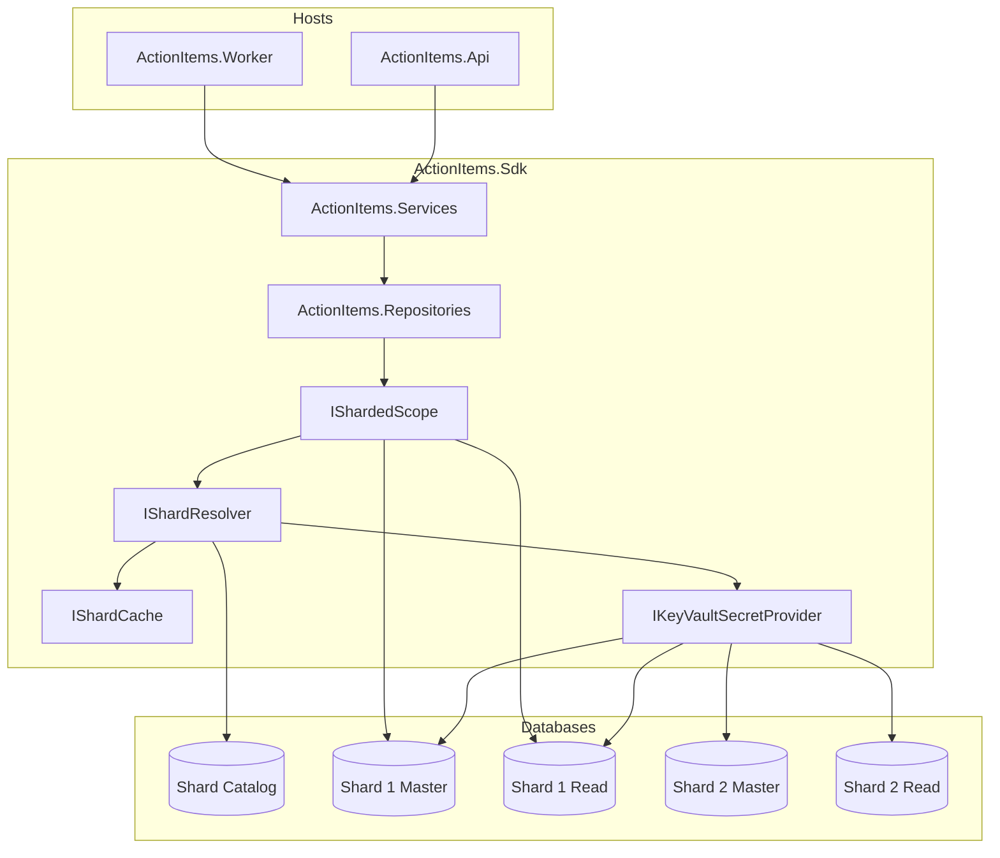

# ActionItems Sharding POC

A .NET proof-of-concept demonstrating **WorkAreaId-based database sharding** shared between a Web API and a background worker. The SDK is structured so you can lift the `ActionItems/` and `Sharding/` folders into a production microservice with minimal changes.

---

## Table of contents

- [What this POC demonstrates](#what-this-poc-demonstrates)
- [Solution layout](#solution-layout)
- [Architecture overview](#architecture-overview)
- [SDK structure](#sdk-structure)
- [Data model](#data-model)
- [Sharding](#sharding)
  - [Shard catalog](#shard-catalog)
  - [Resolution flow](#resolution-flow)
  - [ApplicationIntent (master / read replica)](#applicationintent-master--read-replica)
  - [Round-robin assignment](#round-robin-assignment)
  - [Key Vault secret resolution](#key-vault-secret-resolution)
  - [Shard caching](#shard-caching)
- [Shared DbContext per request](#shared-dbcontext-per-request)
- [Dependency injection](#dependency-injection)
- [Configuration](#configuration)
- [Running locally](#running-locally)
- [API reference](#api-reference)
- [Background worker](#background-worker)
- [Porting to production](#porting-to-production)

---

## What this POC demonstrates

| Concern | Approach |
|---------|----------|
| Sharding key | `WorkAreaId` (GUID) |
| Shard routing | Catalog maps WorkAreaId → ClientId → ShardKey |
| Connection strings | **Not** stored in the catalog — Key Vault secret names only |
| Read scaling | `ApplicationIntent.Read` → read replica(s), or master if none configured |
| Writes | `ApplicationIntent.ReadWrite` → master connection |
| New work areas | Round-robin shard assignment, mapping persisted to catalog |
| Fast lookups | `IShardCache` (in-memory; swap for Redis) |
| Shared context | One `ActionItemsDbContext` per HTTP request / worker scope |
| Cross-service | Same SDK wired into API and Worker |

Replication and master/slave sync are **out of scope** — handled by DevOps / the DBMS. This application only picks the correct connection string.

---

## Solution layout

```
ActionItems.Poc/
├── ActionItems.Poc.slnx
├── README.md
└── src/
    ├── ActionItems.Sdk/       # Shared library (domain + sharding)
    ├── ActionItems.Api/       # Web API — MediatR + Swagger
    └── ActionItems.Worker/    # Background worker — event consumer
```

| Project | Role |
|---------|------|
| `ActionItems.Sdk` | Entities, repositories, services, sharding infrastructure |
| `ActionItems.Api` | REST endpoints, Swagger UI |
| `ActionItems.Worker` | Processes action-item events (add/update via master) |

---

## Architecture overview



**Per-operation flow:**

1. Host receives `WorkAreaId` (route param or event payload).
2. Service calls `IShardedScope.InitializeAsync(workAreaId, applicationIntent)`.
3. `IShardResolver` checks cache → catalog → Key Vault → returns connection string.
4. `ShardedScope` builds one `ActionItemsDbContext` and attaches it to `ShardedDbContextHolder`.
5. Injected repositories (`IEntityRepository`, `IActionItemRepository`) share that context.
6. `SaveChangesAsync()` on any repository commits all pending changes on that shard.

---

## SDK structure

Everything lives in **one project** (`ActionItems.Sdk`), split into two concerns:

```
ActionItems.Sdk/
├── ActionItems/                         # Domain + persistence (shard-agnostic)
│   ├── Entities/
│   │   ├── ActionItem.cs
│   │   └── Entity.cs
│   ├── Data/
│   │   └── ActionItemsDbContext.cs     # Per-shard EF Core context
│   ├── Repositories/
│   │   ├── IActionItemRepository.cs
│   │   ├── ActionItemRepository.cs
│   │   ├── IEntityRepository.cs
│   │   └── EntityRepository.cs
│   ├── Services/
│   │   ├── IActionItemService.cs
│   │   ├── ActionItemService.cs
│   │   ├── IEntityService.cs
│   │   └── EntityService.cs
│   └── DependencyInjection/
│       └── ActionItemsServiceCollectionExtensions.cs   # AddActionItemsPersistence()
│
├── Sharding/                            # Shard routing infrastructure
│   ├── ApplicationIntent.cs
│   ├── IShardResolver.cs / ShardResolver.cs
│   ├── IShardedScope.cs / ShardedScope.cs
│   ├── ShardedDbContextHolder.cs
│   ├── ShardInfo.cs
│   ├── ShardDatabaseInitializer.cs
│   ├── ShardedRepositoryAccess.cs
│   ├── IRoundRobinCounter.cs / RoundRobinCounter.cs
│   ├── Catalog/
│   │   ├── ShardCatalogDbContext.cs
│   │   └── Entities/
│   │       ├── ShardDefinition.cs
│   │       ├── ShardReadReplica.cs
│   │       ├── WorkAreaClientMapping.cs
│   │       └── ClientShardMapping.cs
│   ├── Caching/
│   │   ├── IShardCache.cs
│   │   └── InMemoryShardCache.cs
│   ├── KeyVault/
│   │   ├── IKeyVaultSecretProvider.cs
│   │   └── FileKeyVaultSecretProvider.cs
│   └── DependencyInjection/
│       └── ShardingServiceCollectionExtensions.cs        # AddActionItemsSharding()
│
└── DependencyInjection/
    └── ServiceCollectionExtensions.cs                    # AddActionItemsSdk()
```

---

## Data model

### Shard databases (`ActionItemsDbContext`)

Each shard has its own database containing:

**Entity**
| Column | Type | Notes |
|--------|------|-------|
| `Id` | GUID | PK |
| `Name` | string | |

**ActionItem**
| Column | Type | Notes |
|--------|------|-------|
| `Id` | GUID | PK |
| `WorkAreaId` | GUID | Sharding key (denormalized) |
| `EntityId` | GUID | FK → Entity |
| `Title` | string | |
| `Status` | string | Default: `Open` |
| `CreatedAtUtc` | DateTime | |
| `UpdatedAtUtc` | DateTime? | |

`ActionItem` holds the FK to `Entity` (not the other way around).

### Shard catalog (`ShardCatalogDbContext`)

**ShardDefinition** — registered shards (no connection strings)
| Column | Type | Notes |
|--------|------|-------|
| `ShardKey` | string | PK, e.g. `shard-1` |
| `MasterKeyVaultSecretName` | string | Key Vault secret for write/master; also used for reads when no replicas exist |

**ShardReadReplica** — optional read endpoints per shard (0, 1, or many)
| Column | Type | Notes |
|--------|------|-------|
| `Id` | int | PK |
| `ShardKey` | string | FK → ShardDefinition |
| `KeyVaultSecretName` | string | Key Vault secret for this replica |
| `Order` | int | Round-robin ordering when multiple replicas exist |

**WorkAreaClientMapping** — work area → client (tenant)
| Column | Type | Notes |
|--------|------|-------|
| `WorkAreaId` | GUID | PK |
| `ClientId` | string | External client/tenant identifier |

**ClientShardMapping** — client → shard assignment
| Column | Type | Notes |
|--------|------|-------|
| `ClientId` | string | PK |
| `ShardKey` | string | FK → ShardDefinition |

### Demo seed data

| WorkAreaId | ClientId | Shard |
|------------|----------|-------|
| `11111111-1111-1111-1111-111111111111` | `client-1` | `shard-1` |
| `22222222-2222-2222-2222-222222222222` | `client-2` | `shard-2` |

Each demo shard has **two** read replicas (`shard-*-read-1`, `shard-*-read-2`) to illustrate multi-replica round-robin. A shard with **no** `ShardReadReplica` rows is valid — reads fall back to master.

New work areas (not in the table above) are provisioned on first write: WorkAreaId → ClientId (mock external service or generated id) → shard via round-robin if the client has no shard yet.

---

## Sharding

### Shard catalog

The catalog is a **separate database** (`shard-catalog.db` in the POC). It answers:

> Given a `WorkAreaId`, which client and shard should I use — and which Key Vault secret names apply?

Connection strings are **never** stored here — only Key Vault secret names on `ShardDefinition` and `ShardReadReplica`.

### Resolution flow

```
WorkAreaId
    → IShardCache (hit? return)
    → WorkAreaClientMapping (WorkAreaId → ClientId)
    → ClientShardMapping (ClientId → ShardKey)
    → ShardDefinition (+ ShardReadReplica rows for Read intent)
    → IKeyVaultSecretProvider (resolve connection string)
    → ShardInfo (cached)
    → ActionItemsDbContext
```

### ApplicationIntent (master / read replica)

```csharp
public enum ApplicationIntent
{
    Read,       // → read replica(s), or master if none configured
    ReadWrite   // → MasterKeyVaultSecretName
}
```

Read replicas are **optional per shard**. Each shard can have zero, one, or many `ShardReadReplica` rows:

| Replicas configured | `ApplicationIntent.Read` behavior |
|---------------------|-----------------------------------|
| **0** | Falls back to `MasterKeyVaultSecretName` |
| **1** | Always uses that replica |
| **2+** | Round-robin across replicas (ordered by `Order`) |

| Operation | Intent | Connection |
|-----------|--------|------------|
| GET entities / action items | `Read` | Replica(s) if configured, otherwise master |
| POST / PATCH / create / update | `ReadWrite` | Master |
| Worker event processing | `ReadWrite` (hardcoded) | Master |

In **SQL Server production**, Key Vault secrets contain the full connection string including `ApplicationIntent=ReadOnly` or `ApplicationIntent=ReadWrite`. DevOps manages failover and replication.

In this **SQLite POC**, master and read replicas are separate files (e.g. `shard-1.db` vs `shard-1-read-1.db`, `shard-1-read-2.db`) to simulate the routing behaviour.

### Round-robin assignment

When `IShardResolver.ResolveForCreationAsync` is called for an unmapped work area:

1. Resolve or create `WorkAreaClientMapping` (mock external provider or generated `client-{prefix}`).
2. If the client has no shard, pick next shard from `ShardDefinition` (thread-safe counter) and insert `ClientShardMapping`.
3. Resolve master connection string.
4. Cache `ShardInfo` with `ApplicationIntent.ReadWrite`.

Used when creating the first entity for a new work area.

### Key Vault secret resolution

**POC:** `FileKeyVaultSecretProvider` reads `keyvault-secrets.json`:

```json
{
  "shard-1-master": "Data Source=shard-1.db",
  "shard-1-read-1": "Data Source=shard-1-read-1.db",
  "shard-1-read-2": "Data Source=shard-1-read-2.db",
  "shard-2-master": "Data Source=shard-2.db",
  "shard-2-read-1": "Data Source=shard-2-read-1.db",
  "shard-2-read-2": "Data Source=shard-2-read-2.db"
}
```

A shard that does not use read replicas needs only its `*-master` secret — omit replica secrets and `ShardReadReplica` rows for that shard.

**Production:** Replace `IKeyVaultSecretProvider` with an Azure Key Vault implementation. The catalog schema stays the same — only secret names are stored.

Secrets can also be inlined in `appsettings.json` under `KeyVault:Secrets` for local dev.

### Shard caching

`IShardCache` caches resolved `ShardInfo` per `workAreaId + applicationIntent` (1-hour TTL in the in-memory implementation).

| POC | Production |
|-----|------------|
| `InMemoryShardCache` | Replace with `RedisShardCache` implementing `IShardCache` |

Register your Redis implementation in `ShardingServiceCollectionExtensions` instead of `InMemoryShardCache`.

---

## Shared DbContext per request

This mirrors the standard ASP.NET Core pattern where `AddDbContext` gives one context per request — except the connection string is resolved at runtime from the shard catalog.

```csharp
// Inject both repos + scope in a handler
public sealed class MyHandler(
    IShardedScope shardedScope,
    IEntityRepository entities,
    IActionItemRepository actionItems)
{
    public async Task Handle(Guid workAreaId, ...)
    {
        await shardedScope.InitializeAsync(workAreaId, ApplicationIntent.ReadWrite);

        await entities.AddAsync(new Entity { ... });
        await actionItems.AddAsync(new ActionItem { ... });

        // Either repo commits everything on the shared context
        await entities.SaveChangesAsync();
    }
}
```

**Rules:**
- Call `InitializeAsync` before using repositories.
- `AddAsync` / `Update*` stage changes only — no implicit save.
- `SaveChangesAsync()` on **either** repository flushes all pending changes.
- No auto-save on dispose — you must call `SaveChangesAsync()` explicitly.
- One work area + one intent per scope; scope re-initializes if intent changes.

---

## Dependency injection

Both hosts register the SDK identically:

```csharp
// Program.cs (Api and Worker)
builder.Services.AddActionItemsSdk(builder.Configuration);
await ShardDatabaseInitializer.InitializeAsync(configuration);
```

`AddActionItemsSdk` composes:

```csharp
services.AddActionItemsSharding(configuration);  // catalog, resolver, cache, key vault, scope
services.AddActionItemsPersistence();            // repos + services
```

### Registrations (reference)

| Service | Lifetime | Layer |
|---------|----------|-------|
| `ShardCatalogDbContext` | Scoped | Sharding |
| `IRoundRobinCounter` | Singleton | Sharding |
| `IKeyVaultSecretProvider` | Singleton | Sharding |
| `IShardCache` | Singleton | Sharding |
| `IShardResolver` | Scoped | Sharding |
| `ShardedDbContextHolder` | Scoped | Sharding |
| `IShardedScope` | Scoped | Sharding |
| `IEntityRepository` | Scoped | ActionItems |
| `IActionItemRepository` | Scoped | ActionItems |
| `IEntityService` | Scoped | ActionItems |
| `IActionItemService` | Scoped | ActionItems |

---

## Configuration

### `appsettings.json` (Api / Worker)

```json
{
  "ConnectionStrings": {
    "ShardCatalog": "Data Source=shard-catalog.db"
  },
  "KeyVault": {
    "SecretsFile": "keyvault-secrets.json"
  }
}
```

Only the **catalog** connection string lives in config. Shard connections come from Key Vault secrets.

### Files created at runtime

Created in each host's working directory (`src/ActionItems.Api/` or `src/ActionItems.Worker/`):

| File | Purpose |
|------|---------|
| `shard-catalog.db` | Shard catalog |
| `shard-1.db` | Shard 1 master |
| `shard-1-read-1.db` | Shard 1 read replica 1 |
| `shard-1-read-2.db` | Shard 1 read replica 2 |
| `shard-2.db` | Shard 2 master |
| `shard-2-read-1.db` | Shard 2 read replica 1 |
| `shard-2-read-2.db` | Shard 2 read replica 2 |

`ShardDatabaseInitializer` **always wipes and recreates** all databases on host startup, then seeds demo catalog data (including two read replicas per shard).

---

## Running locally

### Prerequisites

- [.NET 10 SDK](https://dotnet.microsoft.com/download)

### Option 1 — Visual Studio / Rider

Open `ActionItems.Poc.slnx`, set **ActionItems.Api** as startup project, run. Swagger opens at `/swagger`.

### Option 2 — CLI

```bash
# Terminal 1 — API
dotnet run --project src/ActionItems.Api
# Swagger: https://localhost:7201/swagger  (or http://localhost:5274/swagger)

# Terminal 2 — Worker
dotnet run --project src/ActionItems.Worker
```

### Option 3 — VS Code

Use the **API + Worker** compound launch profile in `.vscode/launch.json`.

---

## API reference

Base route: `/api/workareas/{workAreaId}`

### Entities

| Method | Route | Intent | Body | Description |
|--------|-------|--------|------|-------------|
| `POST` | `/entities` | ReadWrite | `{ "name": "..." }` | Create entity. New work areas trigger round-robin shard assignment. |
| `GET` | `/entities` | Read | — | List all entities on the shard |
| `GET` | `/entities/{entityId}` | Read | — | Get entity by ID |

### Action items

| Method | Route | Intent | Body | Description |
|--------|-------|--------|------|-------------|
| `POST` | `/action-items` | ReadWrite | `{ "entityId": "...", "title": "..." }` | Create action item |
| `GET` | `/action-items/{actionItemId}` | Read | — | Get action item by ID |
| `GET` | `/action-items/by-entity/{entityId}` | Read | — | List action items for an entity |
| `PATCH` | `/action-items/{actionItemId}/status` | ReadWrite | `{ "status": "Done" }` | Update status |

### Swagger walkthrough

1. **POST** `/entities` with `{ "name": "Contract A" }` — copy returned `id`.
2. **POST** `/action-items` with `{ "entityId": "<id>", "title": "Review contract" }`.
3. **GET** `/entities` and `/action-items/by-entity/{entityId}` to verify reads hit the replica path.
4. **PATCH** status to verify writes hit the master path.

### curl examples

```bash
WORK_AREA=11111111-1111-1111-1111-111111111111
BASE=https://localhost:7201/api/workareas/$WORK_AREA

# Create entity
curl -k -X POST "$BASE/entities" \
  -H "Content-Type: application/json" \
  -d '{"name":"Contract A"}'

# Create action item (replace {entityId})
curl -k -X POST "$BASE/action-items" \
  -H "Content-Type: application/json" \
  -d '{"entityId":"{entityId}","title":"Review contract"}'

# Get action item (replace {actionItemId})
curl -k "$BASE/action-items/{actionItemId}"

# Update status
curl -k -X PATCH "$BASE/action-items/{actionItemId}/status" \
  -H "Content-Type: application/json" \
  -d '{"status":"Done"}'
```

---

## Background worker

`ActionItems.Worker` simulates an event consumer that updates action item status.

```
EventConsumerWorker (every 10s)
    → ProcessActionItemStatusChangedCommand
        → IShardedScope.InitializeAsync(workAreaId, ApplicationIntent.ReadWrite)
        → IActionItemService.UpdateStatusAsync(...)
```

The worker always uses **`ApplicationIntent.ReadWrite`** — it only performs mutations.

To wire a real message bus, replace the demo loop in `EventConsumerWorker` with your queue/topic consumer; keep the MediatR handler and SDK registration unchanged.

---

## Porting to production

### 1. Copy the SDK folders

Lift `ActionItems.Sdk/ActionItems/` and `ActionItems.Sdk/Sharding/` into your shared library. Call `AddActionItemsSdk(configuration)` from each microservice host.

### 2. Replace Key Vault provider

```csharp
// ShardingServiceCollectionExtensions.cs
services.AddSingleton<IKeyVaultSecretProvider, AzureKeyVaultSecretProvider>();
```

Store secrets like:
```
shard-1-master   → Server=...;Database=...;Application Intent=ReadWrite;...
shard-1-read-1   → Server=...;Database=...;Application Intent=ReadOnly;...
shard-1-read-2   → Server=...;Database=...;Application Intent=ReadOnly;...
```

Register one `ShardReadReplica` row per read endpoint. Shards without replicas need only the master secret — `ApplicationIntent.Read` uses master when no replica rows exist.

### 3. Replace shard cache

```csharp
services.AddSingleton<IShardCache, RedisShardCache>();
```

Cache key format: `shard:workarea:{workAreaId}:intent:{Read|ReadWrite}`

### 4. Swap SQLite for SQL Server

- Catalog: `ShardCatalogDbContext` → SQL Server connection
- Shards: connection strings from Key Vault (already routed by intent)
- Use EF Core migrations instead of `EnsureCreated` in production

### 5. What stays the same

- Catalog schema (`ShardDefinition`, `ShardReadReplica`, `WorkAreaClientMapping`, `ClientShardMapping`)
- `IShardResolver` / `IShardedScope` / repository pattern
- `ApplicationIntent` routing
- `AddActionItemsSdk` composition
- API and Worker registration pattern

### 6. What you own in production

- Azure Key Vault secret management (DevOps)
- Read replica provisioning and DB replication (DBA / DevOps)
- Redis cache infrastructure
- Real message bus for the worker
- EF migrations and deployment pipelines

---

## Key interfaces (quick reference)

| Interface | Namespace | Purpose |
|-----------|-----------|---------|
| `IShardResolver` | `Sharding` | Resolve `WorkAreaId` → `ShardInfo` |
| `IShardedScope` | `Sharding` | Initialize shared `ActionItemsDbContext` per operation |
| `IShardCache` | `Sharding.Caching` | Cache resolved shard info |
| `IKeyVaultSecretProvider` | `Sharding.KeyVault` | Resolve secret name → connection string |
| `IEntityRepository` | `ActionItems.Repositories` | Entity CRUD (shared context) |
| `IActionItemRepository` | `ActionItems.Repositories` | Action item CRUD (shared context) |
| `IEntityService` | `ActionItems.Services` | Higher-level entity operations |
| `IActionItemService` | `ActionItems.Services` | Higher-level action item operations |
